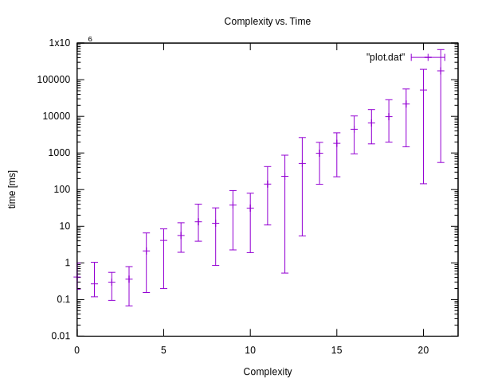

# proof-of-login

> a proof-of-work for your login or registration endpoints

To secure open endpoints like login or registration you might like to add some extra hurdle to the client side.

This package provides methods to create a challenge on the server, which needs be solved on the client side by calculating a nonce. This nonce must match the required complexity of a proof-of-work (PoW).

This nonce together with the challenge is provided on login/ registration and can be easily validated on the server side with a verify method.

**How does it work?**

1. server creates `challenge` which contains complexity, the required hash alogithm for solving, timestamp and a random part.
2. server signs that `challenge` with a secret
3. server provides challenge to client (browser)
4. client needs to calculate a `nonce` for that `challenge`.
   That nonce together with challenge is hashed and the resulting hash needs to match the required complexity (PoW)
5. If a suitable nonce was found the client provides the challenge with the nonce back to the server
6. The server calculates again the hash from challenge and nonce and verifies that the complexity required is given.

The library uses (both on server and client) the [webcrypto API](https://developer.mozilla.org/en-US/docs/Web/API/Crypto) and supports the following hashing algorithms:

- SHA-1
- SHA-256 (default)
- SHA-384
- SHA-512

# Usage

*On Server*
```js
import { Challenge, Verifier } from 'proof-of-login'

const SECRET = 'never change me'
const challenger = new Challenge(SECRET)
const verifier = new Verifier(challenger)

const complexity = 11
const challenge = challenger.create(complexity)

// => send this challenge to the client
```

*At client*
```js
import { solve } from 'proof-of-login'

// => challenge from server
const challenge = 'BQEAAAF9hH/Xb2keJ9PHOZapw9zPXSVyjYmqEPpmGew4pFyTDMY833aTb3KgrJU94H070XFf8IYKSsCR3PGbZA=='
const nonce = await solve(challenge) // might take seme time
//= AAABfYR/17jQB6aVseAeQWHm4gBZo2kT

// => send back `challenge` and `nonce` to server
```

*Back on server*
```js
//...
const isValid = await Verifier.verify(challenge, nonce)
```

# Time needed to calculate nonce

Depending on the complexity the time on average needed to calculate the nonce ca. doubles for each increase in complexity. For a complexity of 21 around 4 minutes must be spent on average <sup><a href="#proc">*)</a></sup>.

Please note, in case of a very lucky guess the time to calculate the nonce can still be in the milliseconds.



*Complexity versus Time in logarithmic scale* 

<a name="proc"></a>

<sup>*)</sup> Results will vary depending on the processing power available.

# Security considerations

To prevent brute force password this library increases the computational efforts on the client side to obtain a result for a password try.

Nonetheless additional measures must be taken into account on the server side to prevent trickeries with lower computational efforts.

## Replay attacks

To prevent replay attacks consider storing the created challenges on the server side. Only if a valid challenge can be found the verification of the nonce is started.

After any succussful or unsuccessful verification delete the challenge and provide a fresh one.

## Fresh challenge attacks

Due to the nature of the unprotected endpoints an attacker can always request a fresh challenge with a low computational complexity. 

Therefor a challenges complexity must always be checked with the number of failed attempts. You may use the username or IP-Address for counting those attempts.

# Example app

A sample application simulating a browser based login can be found at `./example` 

1. clone this project: `git clone --depth 10 https://github.com/spurreiter/proof-of-login`
2. Install dependencies: `npm i`
3. Run example: `npm run example`
4. Browse to: http://localhost:3030
5. Click on "login"
6. Try several logins with a wrong password. The time to solve the challenge increases with the number of failed login attempts.

# License

[MIT licensed](./LICENSE)

